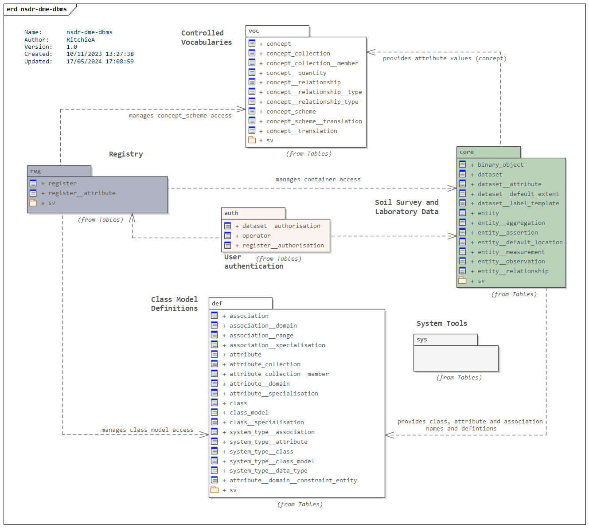

# Datastore Documentation

## Content

| Document                                           | Description                                                                                                   |
|----------------------------------------------------|---------------------------------------------------------------------------------------------------------------|
| This README                                        | An overview of the datastore including a brief summary of the data model.                                     |
| [db-design-principles](./db-design-principles.md)  | A summary of the design principles, conventions and decisions made when designing and building the datastore. |
| [db-schema-auth](./db-schema-auth.md)              | `auth` schema definitions - tables, views and functions.                                                      |
| [db-schema-reg](./db-schema-reg.md)                | `reg` schema definitions - tables, views and functions.                                                       |
| [db-schema-data](./db-schema-data.md)              | `data` schema definitions - tables, views and functions.                                                      |
| [db-schema-def](./db-schema-cm)                    | `cm` schema definitions - tables, views and functions.                                                        |
| [db-schema-voc](./db-schema-voc.md)                | `voc` schema definitions - tables, views and functions.                                                       |
| [db-schema-sys](./db-schema-sys.md)                | `sys` schema definitions - tables, views and functions.                                                       |

## Overview
The database is designed to store information about any environmental entity, and the sampling
activities used to observe and describe them. The main goals are flexibility (allowing the
definition of new classes or properties as required) and accuracy (classes and properties are fully
described with metadata and uncertainty information).

The database comprises five main schema (Figure 1): `auth`, `reg`, `cm`, `voc`, `data` and `sys`.

* `auth` holds the tables, functions and views supporting the PostgreSQL row level security (RLS)
policies that manage access to records by client users.
* `reg` holds the system registry, organising and managing access to sets of data in the `cm`,
`voc`, and `data` schema
* `cm` holds the type definitions for classes and properties stored in the `data` schema.
* `voc` holds the controlled vocabularies used in the `data` schema.
* `data` is an entity-attribute-value (see [db-design-principles](./db-design-principles.md))
database that holds the soil data managed and/or served by the EDR.
* `sys` is a schema for system tables and functions that are used by elements in all other schema.
* `build` is a schema for useful functions that help automate the construction of the database - e.g.
creating all necessary `periods` extension system versioning tables.

> Figure 1. Overview of EDR schema and their base tables.

There is a `working` schema for temporary tables and views - e.g. to support data maintenance and
loading.

## About documentation
A brief summary of the database is presented in this document. For clarity (?!) full definitions for
each schema are maintained in separate documents. Across all mark-down documents the definition
table structure is largely self-explanatory but some unusual conventions for the content are as
follows:

* The key columns refers to whether a column is part of a primary key (PK) or foreign key (FK).
So-called weak foreign keys are shown with a lower case fk - these should have records in the target
table, but may not (probably for no good reason) so referential integrity is not enforced.
* If a foreign key spans two columns the FK value will be given a lower case letter suffix in
brackets (e.g. FK(a)) and be reused by all participating columns.
* The Null column shows if a column or function parameter is required (N for not null) or optional
(Y for null).

> See [db-design-principles](./db-design-principles.md) for an overview of database
> conventions, and explanations of why and how certain things were implemented as they were.

## Required extensions

### PostGIS
Data types and functions for the manipulation and querying of spatial data are implemented using the
`PostGIS` extension (https://postgis.net/).

PostGIS functions and registers are stored in the `public` schema. Functions that support
topological operations are stored in the `topology` schema.

## Schema summary

### System
The `sys` and `build` schemas hold tables, views and functions used throughout the database. These support
essential database operations relating to the generation of resource identifiers, and the generation of
DDL to create objects that manage transaction history and user access.

It also includes a set of helper functions and views to automate the bulk creation of certain
database objects, such as:

* system columns
* system versioning tables
* row level security policies
* views for API middleware (experimental)

### Authentication and authorisation
The `auth` schema holds tables, types, views and functions that support the implementation of
[row level security](https://www.postgresql.org/docs/current/ddl-rowsecurity.html) (RLS) in the
database. Each table in the database will allow select, update, insert and delete operators to users
that also provide a legitimate JSON Web Token (JWT) that includes an operator ID that can be checked
against the access level specified in the relevant authorisation table. This means a client can
access the database using a client specific login role that have been given membership of the
`edr_jwt` group role, and individual users can be distinguished by operator specified in the JWT
claims. This assumes all non-administrative access to the database is via APIs that authenticate
users with the MWLR Authentication Service.

* Operators are registered in `auth.operator`.
* Changes to entities, and their properties and associations, are authorised according access rights
granted on their datasets.
* Changes to datasets and registers, and their properties and associations, are authorised
according access rights granted on their registers.
* An anonymous operator allowing read access to open datasets has been placed in
`auth.operator`. This user may not be granted admin or edit access.
* Rights granted to a parent or ancestor register/dataset are inherited but descendants. Inherited
rights may be overridden by denying a user access - this denial then propagates to all descendants
and cannot itself be overridden.
* For each dataset (register or dataset), the various rights are summarised into arrays of
operators that enforce inherited and denied access in the view `auth.dataset__authorisation`.
* Data administrators and maintainers can be granted the membership of group roles that support
admin (`edr_admin`), edit (`edr_edit`), and read (`edr_read`) tasks. The roles bypass RLS
policies.

> With time, access constraints will extend to the suppression of 'restricted attributes'.

Due to their importance to the management of data, access rights are defined using a PostgreSQL
[enumeration type](https://www.postgresql.org/docs/current/datatype-enum.html):

* `auth_access` (admin, edit, read, deny)

Edit types are only applicable to:

* entities, entity attributes and entity associations
* class, attribute, and association definitions
* concepts and their properties

All users should have read access to datasets. Otherwise, as datasets are inherently
administrative structures, edit access on these is restricted to operators with admin authorisation.

By default, edit and read of access to entities is restricted.

Anything can be subject to read access.

RLS policies use the function `auth.operator_access` to check the operator (by reading the JWT)
against the requested access role (as implied by the SQL operation) and dataset.

The following table summarises the allowable operations on a table type* for a given authorisation**.

| Authorisation | `register` | `dataset`  | `entity`   |
|---------------|------------|------------|------------|
| admin         | S, I, U, D | S, I, U, D | S, I, U, D |
| edit          | S          | S          | S, I, U, D |
| read          | S          | S          | S          |
| deny          | revoke     | revoke     | revoke     |

> \* The table type encompasses associated proeprty tables (e.g. `entity` also includes
`entity__assertion` and so on).

> \*\* S: select; I: insert; U: update; D: delete

> Figure 2. Summary of the `auth` schema authorisation tables.

### Registry
Datasets (class models, concept schemes and collections, and environmental datasets) are managed by
registry tables (Figure 3). The registry is made up of _registers_ that define how the _items_ in
the register (class models, concept schemes and collections, and datasets) are governed and
published. They define ownership, _authorise_ editing rights, and licensing constraints on
publication and use. Registers also include metadata to support discovery and publication (e.g.
providing DOIs for datasets). Datasets managed in `datasets` shall be organised for publication as
`registers`.

Individual entities (and concepts, class and so on) can be organised into registers for publication.

> Figure 3. Summary of the `reg` schema registry tables.

### Definitions and vocabularies
The definition and vocabulary tables are the glue that holds the EAV structure together. They
define:

* the class and property types created as (effectively) the key in the EAV key-value-pairs in the
`data` schema
* the concepts for controlled vocabularies that provide values in the key-value-pairs in the `data`
schema

#### Class models (`cm`)

> Note that class models are manged in a separate database, this database will hold copies of class models
> as required. 

_Class models_ (Figure 4a) define the _class_ and _property (attribute and association) types_ for a
given area of interest (e.g. soil). The _domain_ of a property type is the class (or classes) it
describes, while the _range_ of a property is the type of its value. Literal types - e.g. strings
and integers - a defined using system data types. Class and property types may be _specialised_ into
sub-types - for example the property type `relatedSamplingEntity` can be specialised into
`relatedSoilSample` and `relatedSoilSite`.

All _class models_, _class_ and _property_ types are mapped to a set of strictly controlled
_system types_ (Figure 4b) by the `system__type_id` referencing the relevant system type table. These
tables include full definitions of each system type.

* `cm.system__type__class_model`: covers the classical modelling paradigms (conceptual, logical and
physical).
* `cm.system__type__class`: define a set of fundamental types taken from the RDF, PROV and SOSA
ontologies.
* `cm.system__type__association` (property): fundamental association types.
* `cm.system__type__attribute` (property): fundamental attribute types.
* `cm.system__type__data_type`: fundamental data types for attribute values (derived from UML classes).

System type tables hold ids that are used in views, functions, triggers and so on that manage
content in the `data` schema. As such they can only be changed by the system admin user and system
type ids should only be changed as a last resort and where the system type hasn't been applied to a
class or property type.

The system type of a class or property should not be changed once it has been used as it can have a
significant impact on how records are processed and stored. To protect from disruption, update
triggers on `cm` tables check for the usage of a class or property, restricting change to an id if
it is linked to a used class/property.

> Possibly over-engineering things here - `on update restrict` may be more appropriate. And simpler.

The model for class models is based on the [Resource Description Framework Schema](http://www.w3.org/2000/01/rdf-schema)
(RDFS).

> Figure 4. a) Summary of the `cm` schema class model tables.

> b) Class models, classes, properties and data types with their specialised system types shown as a
> conceptual class model. Definitions of each system type can be found in the system type table
> linked to the instantiating (implementing) cm schema table shown in the diagram.

#### Controlled vocabularies (`voc`)
For controlled vocabularies (Figure 5) _concepts_ (terms) are organised into _schemes_. Concepts may
be related to one another (e.g. as simple hierarchical taxonomies, or equivalence mappings between
schemes) using _semantic relationships_. Concepts and schemes can be _translated_ into multiple
languages. Should concepts need the be aggregated for a particular purpose (say by combining two
schemes, or sub-setting one, or both) a _collection_ is created.

The model for vocabularies is based on the [Simple Knowledge Organisation System](https://www.w3.org/TR/skos-primer/)
(SKOS).

> Figure 5. Summary of the `voc` schema vocabulary tables.

### data

The `data` schema (Figure 6) holds the actual soil survey, sample and laboratory data.

> Figure 6. a) Summary of the `data` schema tables.

 > b) An example of how `data` tables link to `cm` tables.

 

#### Class tables
In the `data` schema classes are implemented in tables holding _entities_ or _datasets_:

* `entities` hold instances of domain and sampling entities
* `datasets` organise `entities` into datasets based on direct ownership by a team or user for
a particular purpose (e.g. a field survey). Dataset access is managed through the registry.

Class tables have a simple structure - records identify the existence of an instance of class and
declare its type (soil, sample, dataset etc) using the `class_id` column referencing the table
`cm.class`.

All properties of a class are held in related _attribute_ and _association_ tables (see below).
Class tables may include properties prefixed with `default_`. These allow a class to be located or
labelled but are not data in their own right. They can only be created by copying or merging data
from property tables.

> Default values may be provided in related tables that extend the base table. For example when not
> all types have a meaningful default value.

#### Class attribute tables
Attribute tables hold attribute values for a class as key value pairs. They declare the type of
attribute (e.g. moisture content) using `attribute_id` referencing the table `cm.attribute`. Rules
for the data type, structure and acceptable values are held against the attribute definition. Values
are held in a JSON object in the `value` column:

* the structure of the value is declared/validated by a JSON schema in the attribute range's
`system__type__data_type.schema_json`
* when the value is a controlled concept its value is a UUID referencing `cm.concept.id`
* when the value is a binary object (e.g. a spectra file) its value is a UUID referencing
`data.binary_object`

Attributes may be asserted or observed:

* _assertions_ are attributes whose values are assigned to an entity, for example a name, id or note
* _observations_ are attributes whose values are estimated at some time using some procedure and the
result has a degree of uncertainty. Some observations are made using an _agent_, perhaps electronic
sensor (a _measurement_) or computer algorithm (_prediction_). The degree of uncertainty should be
captured for measurements/predictions.

Most attribute values in this database are observations or measurements.

There are three base attribute tables based on these specific attribute system types (and their
subtypes):

* `entity__assertion`: A simple attribute whose value is asserted
* `entity__observation`: A simple observation with a procedure and result time
* `entity__measurement`: An extended observation, including agent and uncertainty metadata

Trigger functions on these tables check that the attributes are of the right system type when
records are inserted.

For convenience, all three of these tables can be accessed and updated through a single view:
`entity__attribute`. During inserts, this view uses `instead of` triggers to send a record to the
right base table according to the attribute's system type.

#### Class association tables
Association tables hold references to other entities (e.g. where a horizon is composed of
constituent mottles). The type is a key referencing the table `cm.association`. Rules for the
acceptable entity relationships are held against the association type definition.

As with class tables, associations have core types that are declared via their `system__type_id`
column. The association types are:

* `aggregation` - an association between two classes where the component class cannot exist
independently of the source class. On delete a component must be deleted as well. As the aggregation
table is a many-to-many table, the cascading delete will need to be managed through a trigger or
`instead of` directive.
* `relationship` - a simple association, or link, between classes.  When an associated class is
deleted, only the relationship to the other class is deleted.

There are two base association tables based on these specific association system types (and their
subtypes):

* `entity__aggregation`: An aggregation of entities
* `entity__relationship`: A simple relationship

Trigger functions on these tables check that the relationships are of the right system type when
records are inserted.

For convenience, both of these tables can be accessed and updated through a single view:
`entity__association`. During inserts, this view uses `instead of` triggers to send a record to the
right base table according to the association's system type.

### Table views
A set of human-friendly views is available to help inspect base tables without being confronted by
an ocean of UUIDs. The views have the name of the base table suffixed by `__view` (e.g.
`entity__view`).

> The views are intended to help software and data engineers explore and understand the database, it
> is not anticipated that these will be used to deliver data to clients.

These views substitute UUIDs with the default label (or equivalent) of the related 'thing' (e.g. a
class, attribute or entity identifier). Where sensible, associated classes or entities may be
provided as arrays of default labels.